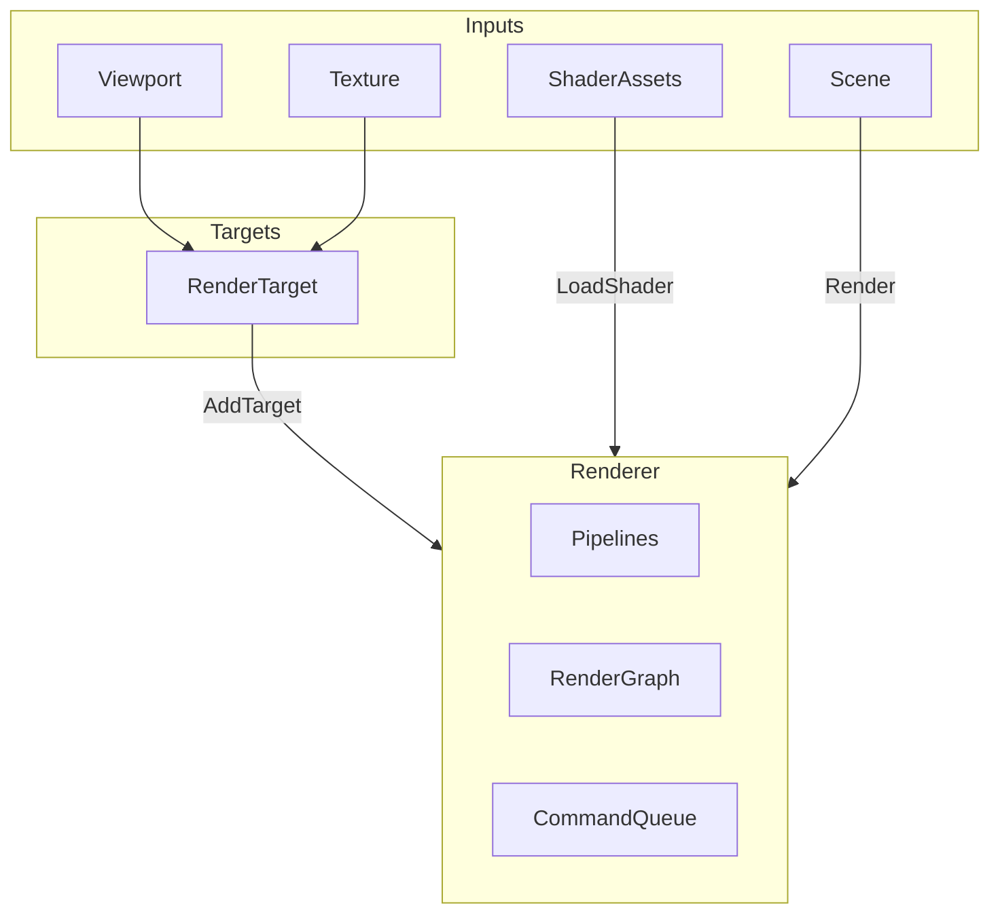

# HydrogenEngine

```mermaid
graph TD

    subgraph Inputs
        Viewport
        Texture
        ShaderAssets
        Scene
    end

    subgraph Targets
        RenderTarget
    end

    subgraph Renderer
        Pipelines
        RenderGraph
        CommandQueue
    end

    Viewport --> RenderTarget
    Texture --> RenderTarget

    RenderTarget -->|AddTarget| Renderer
    ShaderAssets -->|LoadShader| Renderer

    Scene -->|Render| Renderer
```
